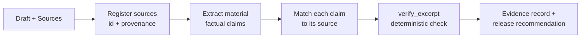

# SourceTrace — Claim Check


**An evidence-integrity desk for editorial and content teams.** Give SourceTrace a draft and the sources it's supposed to rest on. It pulls out every material factual claim, checks whether each one **actually appears in its cited source**, and returns a per-claim evidence record plus a release recommendation — so an unsupported claim, or a quietly swapped number, never rides through on how plausible the sentence sounds.

SourceTrace does **not** rewrite your draft, judge the writing, or decide whether to publish. It answers one question, rigorously: *does this claim rest on the source, yes or no?* A human makes the release call.

> **Live:** connect the MCP endpoint below in Claude or ChatGPT.
> `https://sourcetrace-claimcheck.vercel.app/eve/v1/mcp`

---

## Why it exists

Both people and language models wave through claims that *look* right. The worst case is a single changed token inside an otherwise word-for-word sentence — "$39/month" where the pricing page says "$49/month." Pure text similarity scores that as ~99% identical and lets it pass. SourceTrace is built so that exact failure **cannot** pass: every figure in a claim must be present in the source, or the claim is marked `UNVERIFIED` — and the language model is not allowed to overrule the check.

---

## Quickstart (use it)

1. In **Claude** or **ChatGPT**, add a custom connector pointing at:
   ```
   https://sourcetrace-claimcheck.vercel.app/eve/v1/mcp
   ```
2. Give it a draft and the sources, in plain language:
   > Run SourceTrace on this draft. Draft: "…". Sources: [1] pricing page: "…", [2] uptime report: "…".
3. It returns a **claim map** — each claim, its status, the source it was checked against, and the match method — and a **release recommendation**.

The public endpoint requires no auth. It holds no user data — the draft and sources you pass are used only to produce the report for that call.

---

## How it works



The agent runs a fixed four-step pipeline (one skill each), but the verdict is **not** the model's opinion — it's the output of a deterministic tool:

1. **Register sources** — each source gets an id, a description, and its full text.
2. **Extract claims** — every material factual claim is pulled from the draft in its *exact wording*, with a materiality level. Opinion and framing are excluded (`NOT_APPLICABLE`).
3. **Match & verify** — each claim is checked against its source with the `verify_excerpt` tool. The tool's result is recorded **verbatim**.
4. **Report** — the claim map and release recommendation are assembled from the recorded results, not from how convincing the draft reads.

**Guarantee:** a claim can be marked `VERIFIED` **only** when `verify_excerpt` returns `verified: true` for that exact claim. If the tool says `unverifiable`, the status is `UNVERIFIED` — the model has no authority to round up.

---

## The verification engine (`verify_excerpt`)

Deterministic, auditable, and the single source of truth for a claim's status.

**Input**
```ts
{ source_id: string, source_text: string, claimed_excerpt: string }
```
**Output**
```ts
{
  source_id: string,
  verified: boolean,
  verification_method: "exact_match" | "fuzzy_match" | "unverifiable",
  similarity: number,          // 0–1
  reason?: string              // e.g. "figure(s) not found in source: 39"
}
```

**Decision order**
1. **Figure guard (hard fail).** Every numeric figure in the claim — price, percentage, count, year — must also appear in the source. If any is missing → `unverifiable`, regardless of wording. *This is what catches the swapped number.*
2. **Exact match.** After normalization (lowercase, punctuation stripped, whitespace collapsed), if the source contains the claim as a substring → `exact_match`, `similarity: 1`.
3. **Fuzzy match.** Otherwise compute the max of token-Jaccard and a best-contiguous-window similarity; **≥ 0.60** → `fuzzy_match` (the window test lets a short excerpt match inside a long source without rewarding coincidental bag-of-words overlap).
4. Otherwise → `unverifiable`.

### Evidence statuses

| Status | Meaning |
|---|---|
| `VERIFIED` | `verify_excerpt` returned `verified: true` (`exact_match` or `fuzzy_match`) |
| `CLIENT_STATED` | Claim came from the client with no independent source to check against |
| `UNVERIFIED` | `verify_excerpt` returned `verified: false`, or no source was supplied |
| `CONTRADICTED` | Two supplied sources materially disagree on the same claim |
| `NOT_APPLICABLE` | Opinion or framing, not a checkable factual claim |

---

## Example

**Draft:** *"The Pro plan is $39/month and the service maintained 99.9% uptime last quarter."*
**Sources:** `[pricing]` "Pro plan — $49/month." · `[status]` "Q3 uptime: 99.9%."

| Claim | Checked against | Method | Status |
|---|---|---|---|
| "Pro plan is $39/month" | `pricing` | `unverifiable` — figure `39` not in source | **UNVERIFIED** |
| "99.9% uptime last quarter" | `status` | `exact_match` | **VERIFIED** |

**Release recommendation:** hold — one material pricing claim is unverified (source says $49, not $39).

---

## Architecture

Built on [eve](https://github.com/vercel/eve) (Vercel's agent framework), deployed to Vercel as a public MCP server.

```
agent/
  agent.ts                         # Claude via anthropic() (ANTHROPIC_API_KEY)
  instructions.md                  # the Conductor: pipeline + hard rules
  tools/verify_excerpt.ts          # deterministic verification engine
  skills/
    source-register-and-provenance.md
    claim-extractor-and-materiality.md
    evidence-matcher.md
    evidence-report-and-release-gate.md
  channels/
    mcp.ts                         # mcpChannel({ auth: none() }) → /eve/v1/mcp
    eve.ts                         # native/conversational channel
```

Over MCP the server exposes eve's durable-work tools — `agent_start` / `agent_get` / `agent_update` / `agent_cancel`. `agent_start` runs the pipeline; `verify_excerpt` is called internally.

---

## Develop

```bash
npm install
cp .env.local.example .env.local     # add ANTHROPIC_API_KEY
eve dev                              # interactive TUI
npx tsc --noEmit                     # typecheck
```

## Deploy

```bash
eve link --project sourcetrace-claimcheck --non-interactive
printf '%s' "$ANTHROPIC_API_KEY" | vercel env add ANTHROPIC_API_KEY production --sensitive --token "$VERCEL_TOKEN"
eve deploy --project sourcetrace-claimcheck --non-interactive --yes
```

Verify the live endpoint (no model cost):
```bash
curl -s -X POST https://sourcetrace-claimcheck.vercel.app/eve/v1/mcp \
  -H "Content-Type: application/json" -H "Accept: application/json, text/event-stream" \
  -d '{"jsonrpc":"2.0","id":1,"method":"tools/list","params":{}}'
```

---

## Design principles

- **Deterministic verdicts.** The status of a claim comes from code, not model confidence — and the model cannot override it.
- **Numbers are unfakeable.** The figure guard fails a swapped price/percentage/year outright.
- **No fabrication.** Never invents a citation, excerpt, source, or date. A client's own assertion is recorded as `CLIENT_STATED`, not evidence.
- **Reports, doesn't rule.** Produces the evidence record; a human makes the release decision.

## Limitations

- Matching is **lexical**, not semantic — it verifies that a claim's text rests on the source text, not that a paraphrase is *conceptually* true. Provide the actual source text; it does not browse the web.
- Not a substitute for legal, medical, or financial review, and it makes no such determinations.

---

## Versioning

**v1.0.0** — first stable release.
- Deterministic `verify_excerpt` engine: exact / fuzzy (≥ 0.60) / unverifiable.
- Figure guard: any numeric figure absent from the source forces `unverifiable`.
- Four-stage pipeline (register → extract → match → report) with model-can't-override enforcement.
- Public MCP server on Vercel; connectable from Claude and ChatGPT.

Roadmap (see `sourcetrace-openai-appstore-readiness.md`): a synchronous `verify_claims` tool with correct read-only annotations and a custom domain, for ChatGPT app-directory submission.

## License

Proprietary © 2026 EditorialOS. All rights reserved. Not licensed for redistribution.
